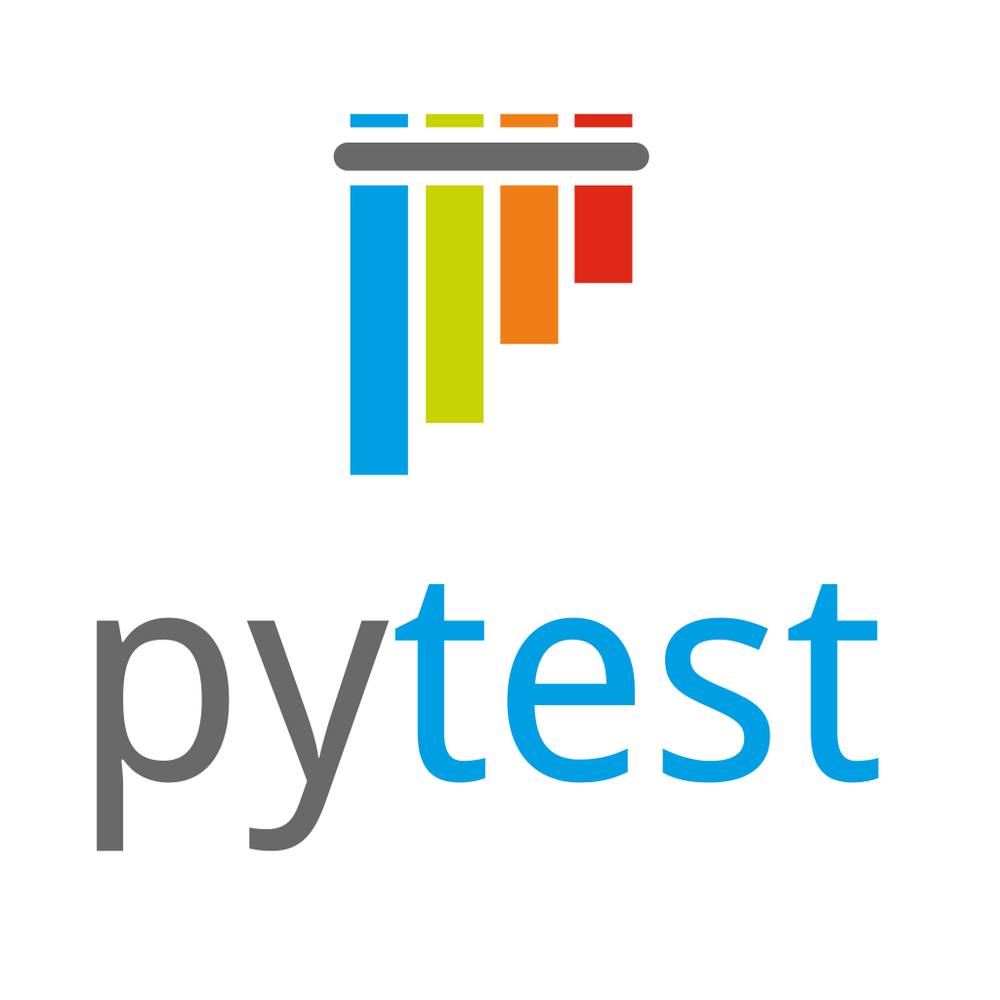
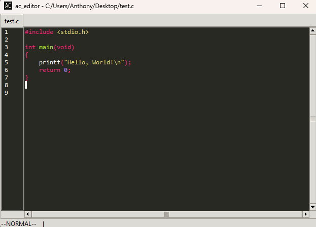

# AC-Editor
Welcome to AC-Editor!<br> 
This is a small, lightweight, shortcuts-based editor that I made for myself, intended to be used primarily for note-taking. 

## Tech 

[](https://www.python.org/) &nbsp;&nbsp;&nbsp;&nbsp;&nbsp;&nbsp;&nbsp;&nbsp;&nbsp;
[](https://sqlite.org/) &nbsp;&nbsp;&nbsp;&nbsp;&nbsp;&nbsp;&nbsp;&nbsp;&nbsp;
[](https://www.tcl.tk/) &nbsp;&nbsp;&nbsp;&nbsp;&nbsp;&nbsp;&nbsp;&nbsp;&nbsp;
[](https://docs.pytest.org/en/stable/)

## Screenshot


## Vim Command Demo Video
[](https://www.youtube.com/embed/sQxEOvUJhyQ)

## Usage

To use this project, follow the instructions below from the top level directory.

```bash
# To install the necessary dependencies for this project
pip install -r requirements.txt 
# or
python3 -m pip install -r requirements.txt

# There are also scripts to run it included for you
# They will perform the second option above
./run.ps1 -install
./run.sh -install
```

```bash
# To start up the editor
python3 -m src.ac_editor

# There are also scripts to run it included for you
./run.ps1 
./run.sh
```

```bash
# To run tests
pytest

# There are also scripts to run it included for you
./run.ps1 -test
./run.sh -test
```

## Motivation
I like using Notepad++, and I also like using Vim. While programming, I like to keep open a lightweight text editor alongside my IDE 
to take notes in. Most of the time this is Notepad++, but I find myself missing having Vim motions available. 
Therefore, I decided to make this small, lightweight text editor for me to take notes in, that supports a small subset of the 
Vim commands I use the most. 
<br><br>
<i>Why not make a plugin for Notepad++?</i><br>
While the thought did cross my mind, I eventually came to the conclusion that it might be better to just write my own editor from scratch, since I will get more experience with GUIs, databases, and writing/desigining projects from the ground up. 

## Supported Vim Commands

The subset of Vim commands supported by this editor are listed below:

```
- :w            (write file)
- :q            (close file)
- :q!           (close file without saving) 
- :wq           (write file, then close file)
- i             (enter INSERT mode)
- esc           (enter NORMAL mode)
- <NUM> h       (move cursor left NUM spaces)
- <NUM> j       (move cursor down NUM lines)
- <NUM> k       (move cursor up NUM lines)
- <NUM> l       (move cursor right NUM spaces)
- A (shift + a) (move cursor to end of line and enter INSERT mode)
- ^ (shift + 6) (move cursor to start of line)
- $ (shift + 4) (move cursor to end of line)
- gg            (move cursor to beginning of document)
- G (shift + g) (move cursor to start of final line of document)
```

<br>
Commands I would like to support in the future are below:

```
- v       (enter VISUAL mode)
- /       (find and replace)
- <NUM> w (jump NUM words in the line)
```

## List of Shortcuts
Here are the non-Vim shortcuts supported by the editor:

```
############################################
# The functionality described in this block
# may be removed in favour of using vim 
# commands exclusively in the future

- ctrl + s       (save current file)
- ctrl + alt + s (save current file as)
- ctrl + o       (open file)
############################################

- ctrl + n       (create new file)
- ctrl + tab     (switch notebook tabs, supported through Windows)
```

## Limitations

- I have only tested this project on Windows.
- `VISUAL` mode is not currently supported, though you can click and drag with your mouse. 
- Rebinding keys is not currently supported. 
- Changing settings such as font size and theme is not currently supported. 


